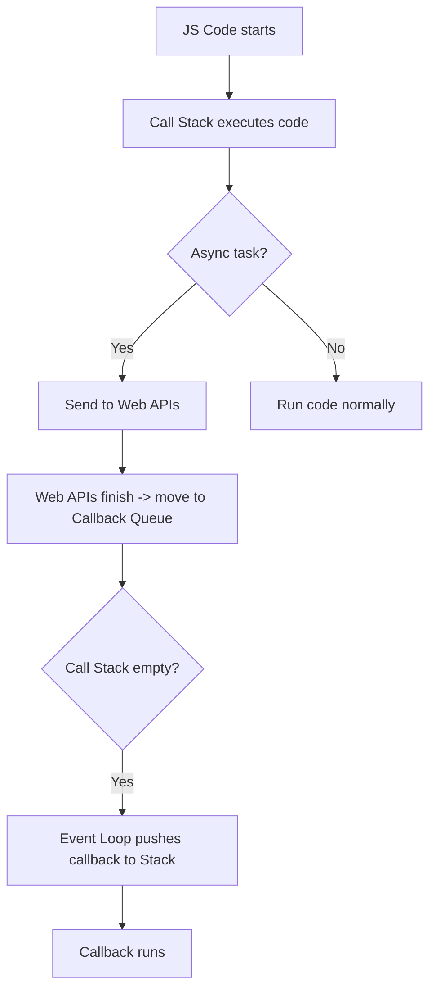

 
## 🧠 JavaScript Event Loop – Animated Explanation

JavaScript is **single-threaded**, which means it can do **one thing at a time**. But it can still handle **asynchronous code** thanks to the **Event Loop**.

Let’s walk through a visual story:

---

### 🔧 Key Players in the Event Loop:

- 🧠 **Call Stack** – "Do it *now*"
- 🌐 **Web APIs / Browser APIs** – "Let me handle the async stuff"
- 📬 **Callback Queue (Task Queue)** – "Waiting to be served"
- 🔁 **Event Loop** – "The traffic cop"

---

## 🎬 Step-by-Step Animation

### 1. 🧠 Call Stack – The Synchronous Execution Engine

```js
console.log('A');
setTimeout(() => console.log('B'), 0);
console.log('C');
```

#### What happens?

**Step 1**:  
🧠 Call Stack pushes `console.log('A')`  
🧠 It runs -> prints ➡️ `A`  
🧠 Stack pops it out  

**Step 2**:  
🧠 Call Stack hits `setTimeout`  
🌐 Web API takes over timer task (0ms doesn't mean immediate)  
🧠 Stack continues  

**Step 3**:  
🧠 Executes `console.log('C')`  
✅ Prints ➡️ `C`  
🧠 Stack is now empty  

**Meanwhile...**

🌐 Web API finishes timer  
📬 Sends callback `() => console.log('B')` to Callback Queue  

**Event Loop kicks in**  
🔁 Checks if Call Stack is empty ✅  
📬 Moves callback to Call Stack  
🧠 Executes `console.log('B')`  
✅ Prints ➡️ `B`

---

## 📊 Visualization Table

| Step | Component        | Action                                 |
|------|------------------|----------------------------------------|
| 1    | Call Stack       | `console.log('A')` prints `A`          |
| 2    | Web API          | `setTimeout(..., 0)` handled async     |
| 3    | Call Stack       | `console.log('C')` prints `C`          |
| 4    | Callback Queue   | `console.log('B')` queued              |
| 5    | Event Loop       | Moves `B` to stack if empty            |
| 6    | Call Stack       | `console.log('B')` prints `B`          |

---

## 🧩 Let’s Add a DOM Event Example

```js
document.getElementById("btn").addEventListener("click", () => {
  console.log("Button clicked");
});
console.log("Waiting for click...");
```

**What happens?**

1. Registers event listener ✅  
2. Logs ➡️ `"Waiting for click..."`  
3. User clicks the button 🖱️  
4. Callback moves to queue 📬  
5. Event Loop pushes it when stack is clear 🔁  
6. Logs ➡️ `"Button clicked"`  

---

## 🪜 Summary Flow



---

## 🧠 Key Takeaways

- JavaScript is single-threaded but non-blocking
- `setTimeout(fn, 0)` still waits
- The **event loop** ensures async tasks don’t interrupt the main thread
- Use **async/await** to write cleaner async logic (promises handled via microtasks)

---

## 🛠️ Play With It Yourself

Try this in the [DevTools Console]:

```js
console.log('1');

setTimeout(() => {
  console.log('2');
}, 0);

Promise.resolve().then(() => {
  console.log('3');
});

console.log('4');
```

**Expected Output**:
```
1
4
3
2
```

Why?  
✅ Promise `.then()` goes to **microtask queue** (executes before callback queue)
